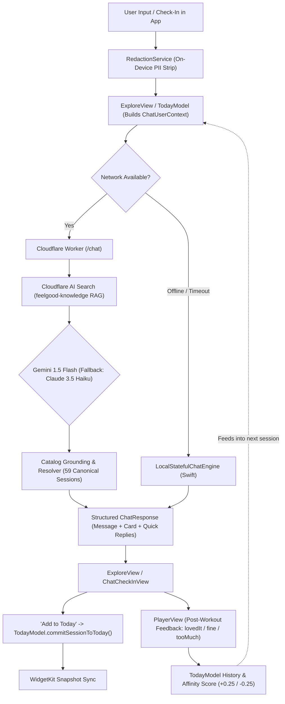

# FeelGood AI Companion & Recommendation Engine

This document provides a comprehensive technical reference for the FeelGood chat companion, edge routing, model failover, catalog grounding, and user feedback loop.

---

## 1. Technology Stack

| Layer | Technology | Key Details & Responsibilities |
| :--- | :--- | :--- |
| **iOS Client** | **Swift 6 / SwiftUI** | Modern Observation framework, pure-state views, on-device offline fallback engine (`LocalStatefulChatEngine`), and on-device input sanitization (`RedactionService`). |
| **Edge Backend** | **Cloudflare Workers (TypeScript / V8)** | Serverless edge proxy at `/chat` handling LLM orchestration, catalog grounding, intent routing, and fallback. |
| **Knowledge / RAG** | **Cloudflare AI Search (`feelgood-knowledge`)** | Sub-second semantic search over Dopamine Menu exercises, FAQs, safety, and subscription guidelines. |
| **Primary LLM** | **Google Gemini 1.5 Flash** | Sub-second latency response generation with structured JSON schema enforcement. |
| **Failover LLM** | **Anthropic Claude 3.5 Haiku** | Low-latency tool-calling fallback if Gemini hits rate limits or latency ceilings. |
| **Local Fallback** | **Swift Heuristic Engine** | Complete zero-network offline companion matching backend state transitions & catalog rules. |
| **Telemetry & Subs** | **RevenueCat / PostHog** | Paywall state detection and usage event tracking. |

---

## 2. System Architecture & Flow



---

## 3. Key Implementation Details

### A. Strict Catalog Grounding (No Hallucinations)
- The entire 59-session catalog from `FeelGood/Content/catalog.json` is indexed in `worker/src/catalog_index.ts`.
- Every recommendation returned by Gemini or Claude is passed through `resolveCanonicalRecommendation()`.
- If an LLM suggests an unrecognized ID or hallucinated name, the resolver selects the best-matching canonical catalog session (matching duration, body focus, equipment, and user affinity) with 100% playable authored steps or YouTube video IDs.

### B. User Feedback & Affinity Loop
1. **Post-Session Logging**: At the end of every workout in `PlayerView.swift`, the user selects their feel:
   - `lovedIt`: Boosts activity affinity (+0.25)
   - `fine`: Neutral baseline
   - `tooMuch`: Reduces activity affinity (-0.25) and marks recovery debt.
2. **Context Passing**: `ExploreView.swift` builds `ChatUserContext` containing:
   - `likedActivities`: All activities the user rated `lovedIt`.
   - `lastFeel`: The most recent feedback rating.
   - `recoveryOwed`: True if the user recently reported `tooMuch`.
3. **Agent Adaptation**:
   - In `worker/src/chat.ts`, `buildSystemPrompt()` instructs the LLM:
     > *"USER RECENT FEEDBACK: The user recently found a workout too demanding ('tooMuch') or is in recovery debt. Strongly favor gentler, supported floor/mat options with lower intensity."*
   - In `matchBestSession()`, routines matching liked activities get a +12 score boost, while intense dynamic routines get penalized (-20) when recovery is owed.

### C. Direct Commit to Today's Menu
- When the user taps **"Add to today"**, `ExploreView.swift` calls `TodayModel.commitSessionToToday()`.
- This swaps the course directly into Today's menu with immediate visual feedback (`"Added to today's menu"`), persists the state, and immediately updates the Lock Screen / Home Screen widget timeline.

### D. Conversational Needs Discovery
- When a user provides vague or non-specific replies (e.g. *"no"*, *"nah"*, *"it feels okay"*, *"not sure"*, *"meh"*), the companion enters `phase: "needs_discovery"`.
- It does not force an exercise card and instead asks a gentle clarifying question (e.g. *"Got it. Would you prefer a short breath reset, a gentle floor stretch, or something to build a little energy?"*) with discovery action chips.

---

## 4. How to Test & Run

### A. Run iOS Simulator Unit Tests
```bash
xcodebuild test \
  -project FeelGood.xcodeproj \
  -scheme FeelGood \
  -destination 'platform=iOS Simulator,id=42624EFC-8298-45F0-A2A7-F20D18AA1525' \
  -only-testing:FeelGoodTests/ChatServiceTests
```

**Verified Test Cases:**
1. `localStatefulEngineExtraction`: Intent classification & duration/body/energy check-in extraction without substring collisions.
2. `localStatefulEngineVagueInputDiscovery`: Conversational discovery questioning on vague inputs without returning unneeded exercise cards.
3. `localStatefulEngineInquiry`: Contextual answers for user concerns (e.g. *"what if I can't sit still"*).
4. `localStatefulEngineAcknowledgment`: Conversational commitments (`"sounds good"`, `"ok"`).
5. `overridesFallbackDefaults`: `ConversationalOverrides` gracefully defaulting missing check-in fields.
6. `chatServiceSanitizesInput`: PII redaction (stripping emails/phone numbers before network transmission).
7. `commitSessionToTodayMenu`: Direct menu replacement and reason attribution in `TodayModel`.

### B. Typecheck & Test the Cloudflare Worker
```bash
cd worker
npm install
npx tsc --noEmit
```

### C. Running Edge Worker Locally
```bash
cd worker
npx wrangler dev
```

### D. Streaming Live Worker Logs
```bash
cd worker
npx wrangler tail
```
